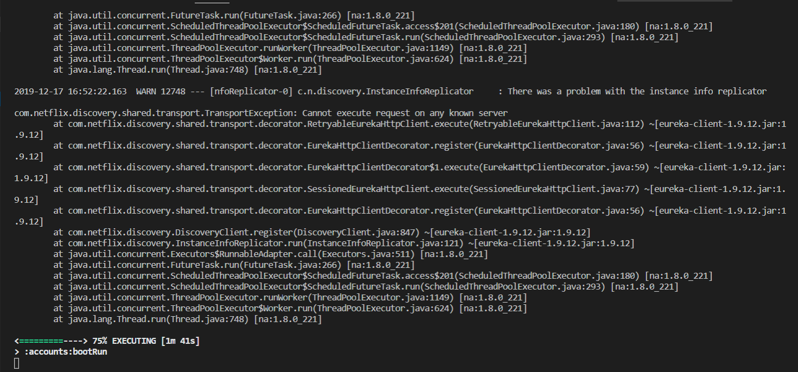
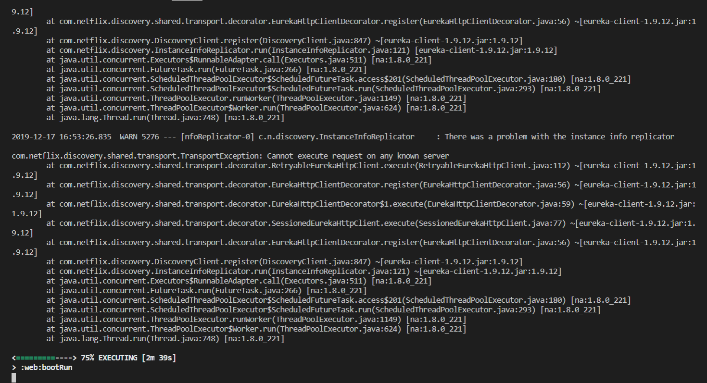
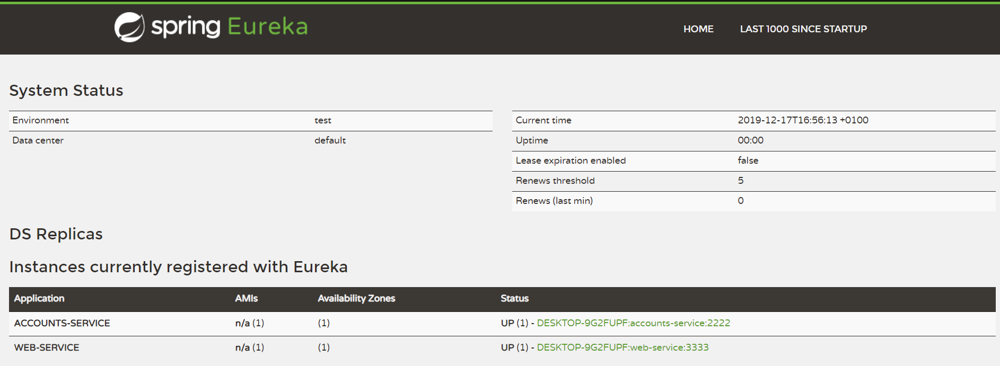
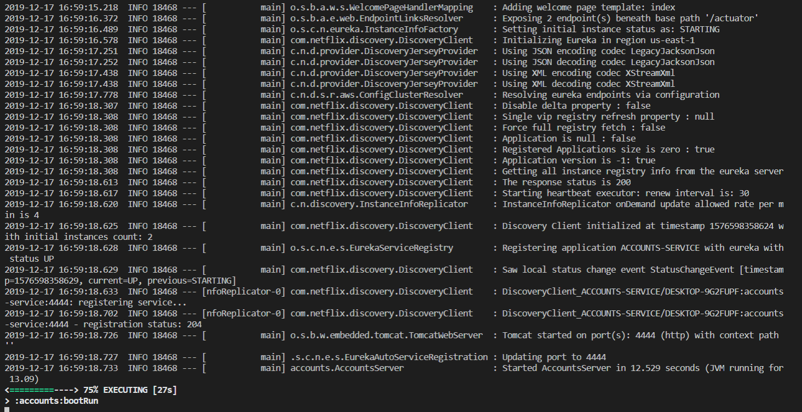
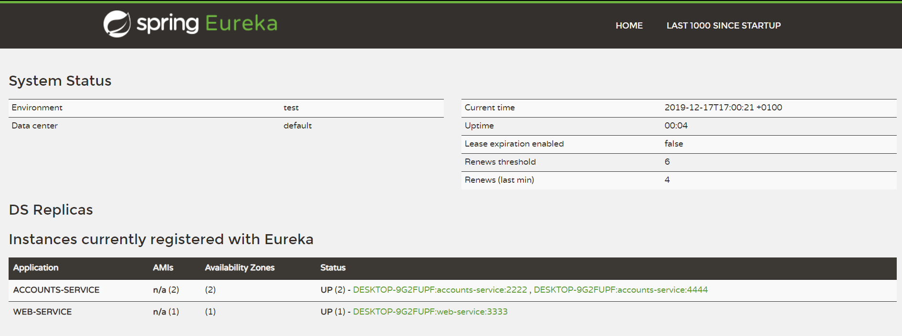
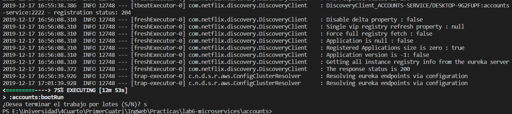
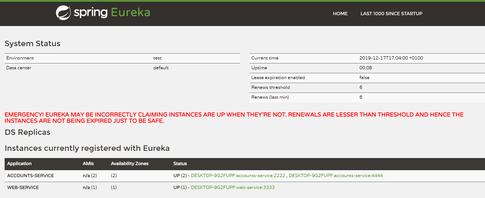
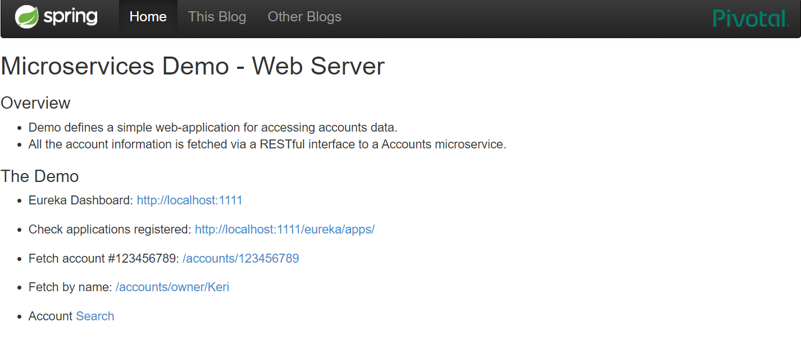
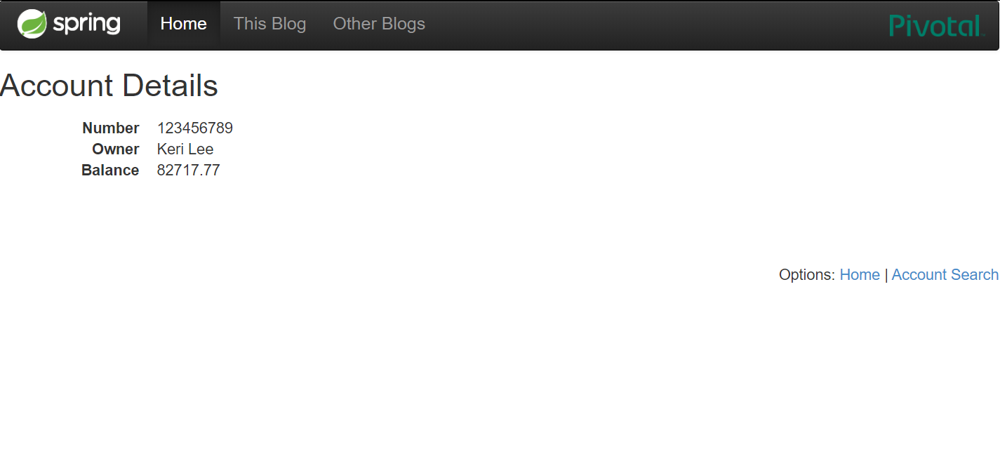
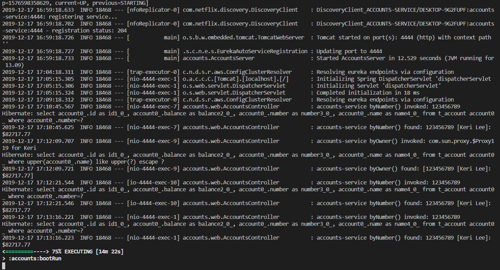

# Lab6 - Microservices - Documentation

**1)** The two microservices are running and registered (two terminals, logs screenshots).
---
You can see the first account Microservice up and registered:

You can see the web Microservice up and registered:

---
**2)** The service registration service has the two microservices registered (a third terminal, dashboard screenshots)
---

---
**3)** A second account microservice is running in the port 4444 and it is registered (a fourth terminal, log screenshots).
---

The port in file [application.yml](accounts/src/main/resources/application.yml) has been changed. (port: 4444)

You can see the second account Microservice up on port 4444 and registered:

Dashboard in Eureka:

---
**4)** A brief report describing what happens when you kill the microservice with port 2222. Can the web service provide information about the accounts? Why?
---

Kill first account on port 2222:

Dashboard in Eureka:

When the first microservice listening on port 2222 is killed and you try to retrieve information about the accounts, you can still get it, because the application swaps the microservice and gets the information from the microservice listening on port 4444, which is a replica.

You can see the demo application and the information retrieved from the microservice on port 4444:

You can see Logs of second accounts microservice on port 4444:

